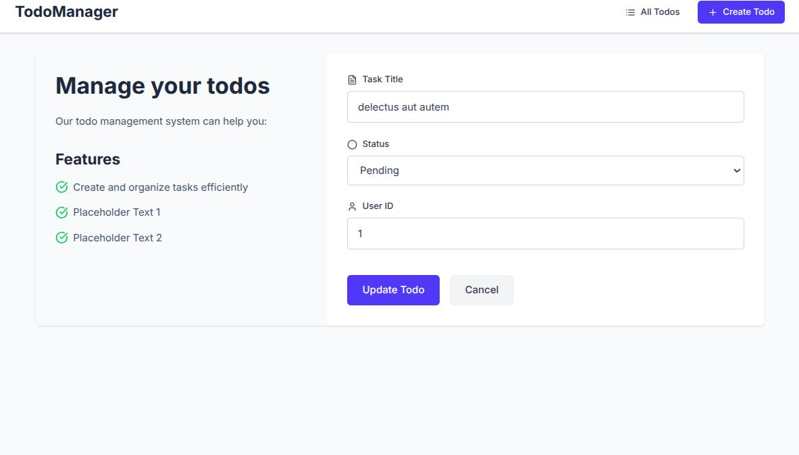

# Todo Manager
Simple todos listing page, using data from https://jsonplaceholder.typicode.com/todos

### Functionality
Todo list page: "/"

Todo detail page:"/todos/[id]"

Create page: "/todos/create"

Edit page: "/todos/[id]/edit

### Render strategy
Todo list page: client side, RTK Query

Todo detail page: ISR, revalidated on client side using RTK Query

Edit page: SSR

### Screenshots

